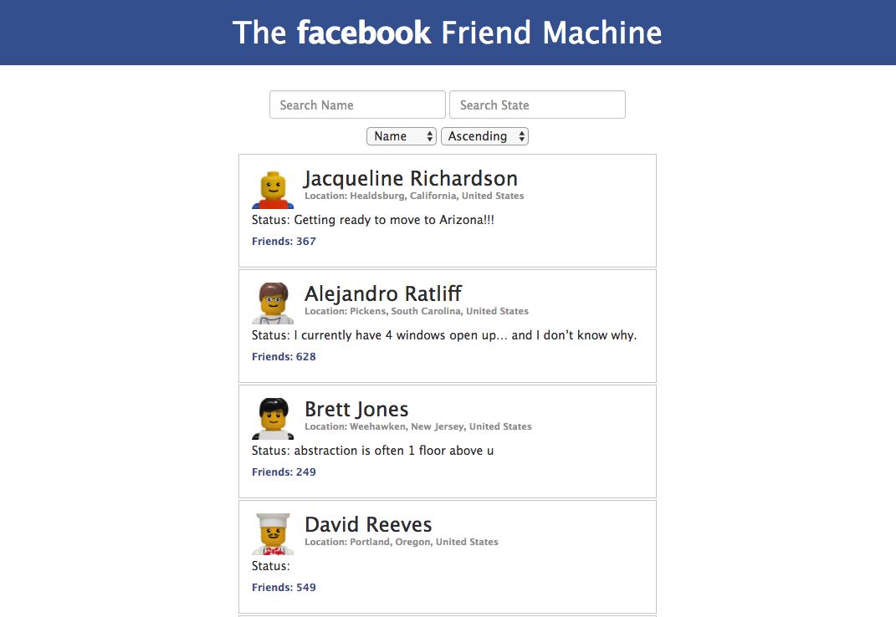
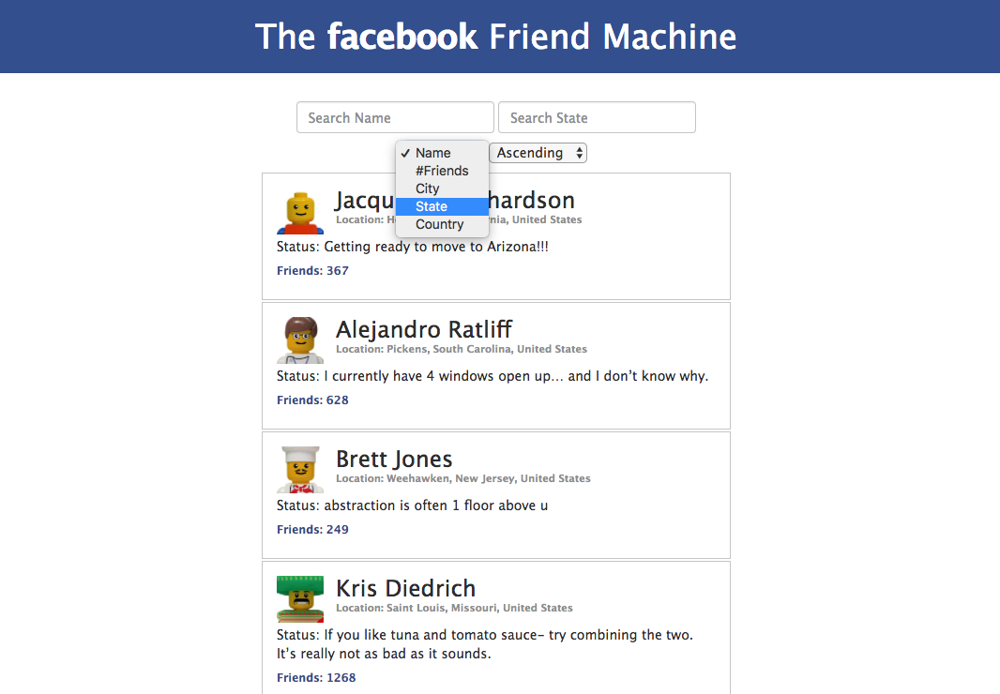
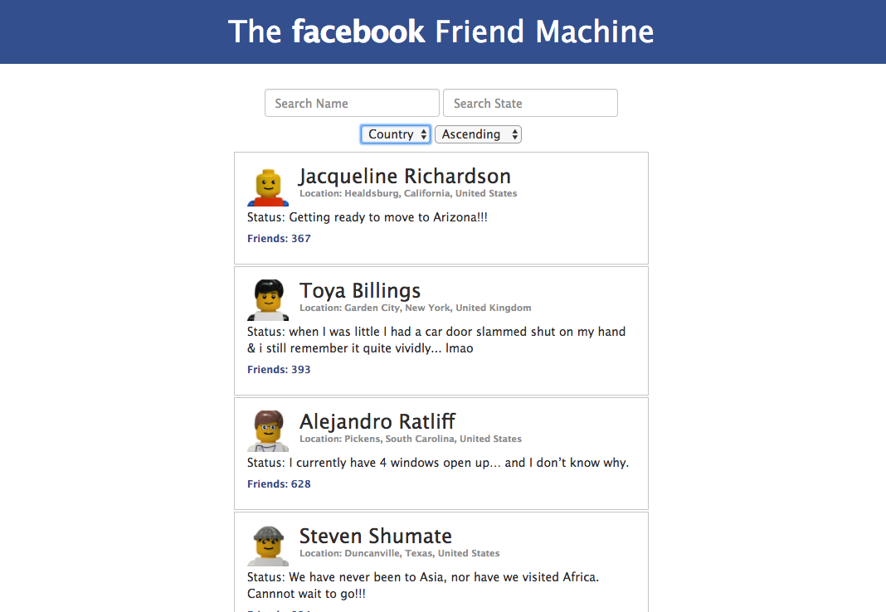
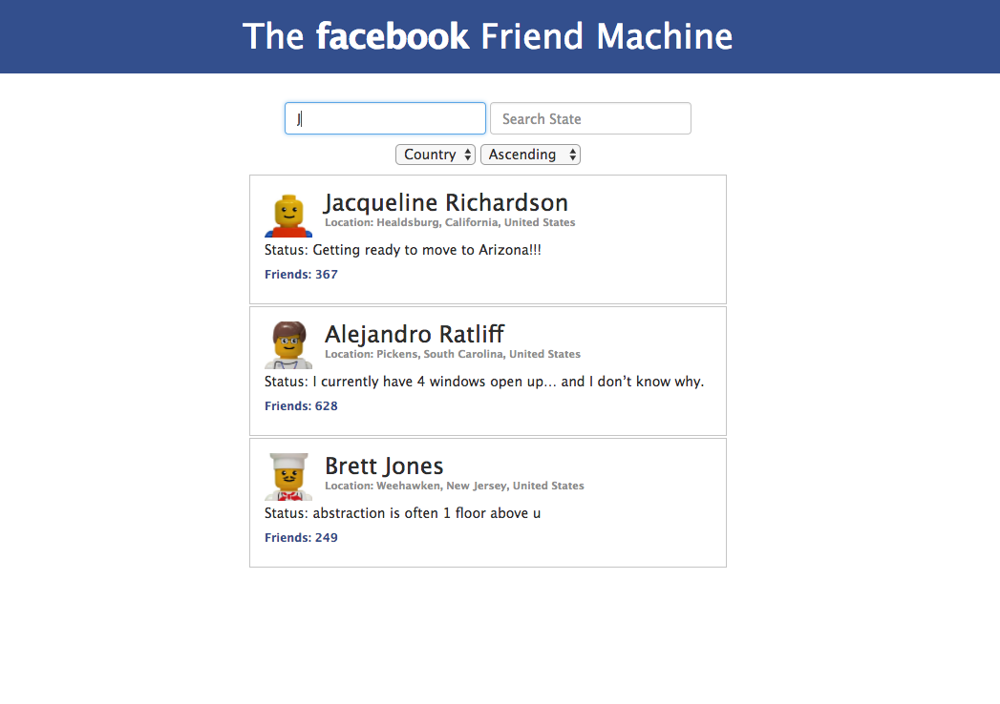

# [afternoon project](https://github.com/DevMountain/angular-1-afternoon)
## our first angular app! 

### Overview
In this project, we'll create an Angular application that displays a list of your friends. The list will be searchable and filterable through user interaction. You can see a live demo by clicking on the link below.

Live example: <a href="https://devmountain.github.io/angular-1-afternoon/">Click Me!</a>

### Setup
1. `cd` into project directory
2. `npm i`
3. `npm run dev` or `live-server` to launch a live view

### Or just check out these cool images of the complete product:
#### Landing View:

#### `Filter by:` Options:

#### Filter Success! 

#### Search Success! 
