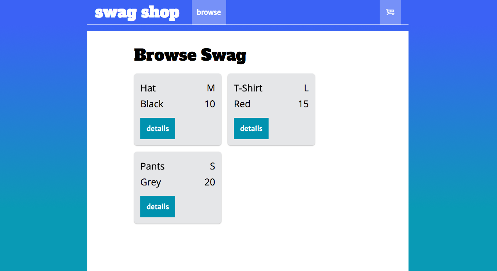
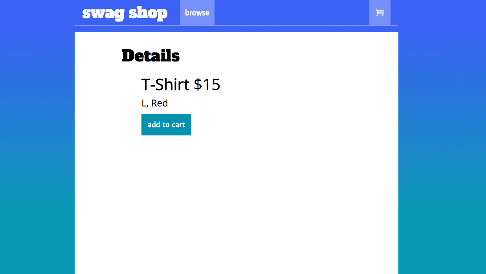
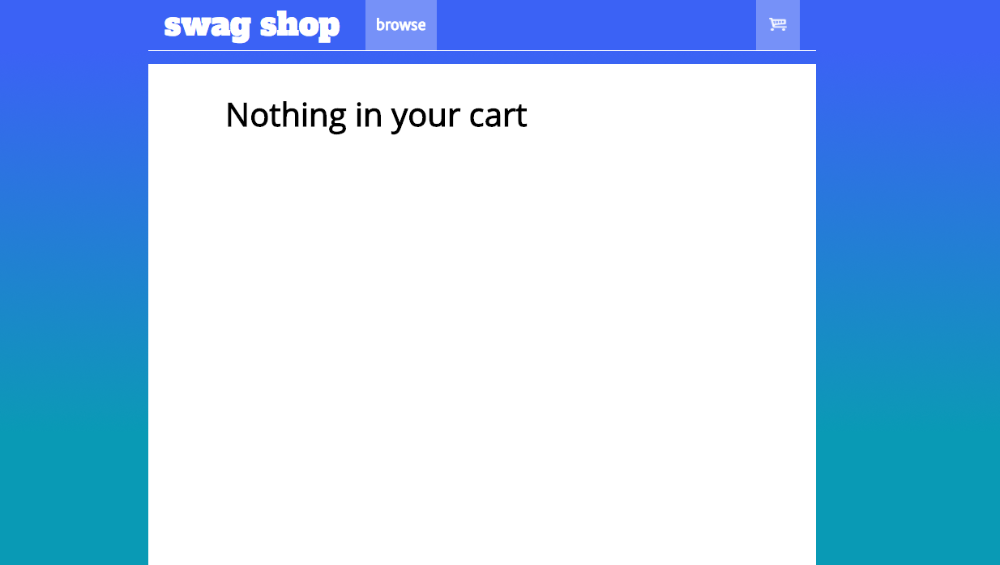

## [swag-shop](https://github.com/DevMountain/angular-3-afternoon)

### Black Diamond:
- notification of any type when 'add to cart' is clicked
    - async call to server?
    - spinner => 'done'?
    - 'count' on cart ++
- details onClick for each item

## Setup:
1. `cd` into `swag-shop` directory
2. `npm i`
3. `npm run dev` or `live-server`

## Or just check out these views of the final product:
#### View of Swag Page:

#### Item Details View:

#### View of Empty Cart:

#### View of Full Cart:
`... to be added...`